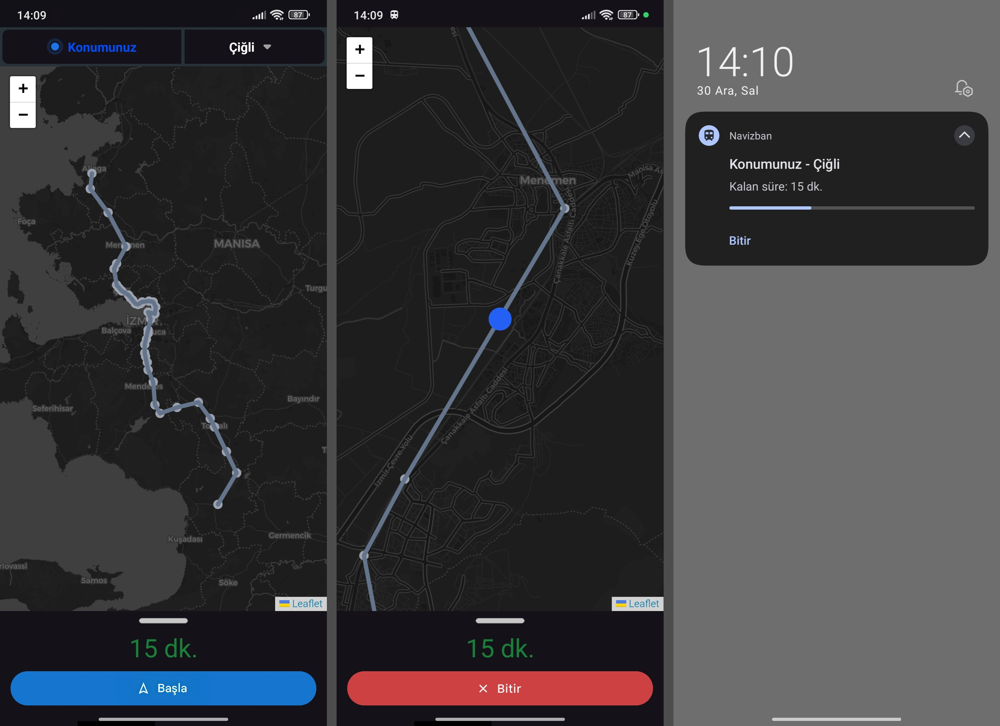

# 🚆 Navizban v1.2 Beta

**İZBAN (İzmir Banliyö A.Ş.) için akıllı tren navigasyonu ve anonim takip uygulaması**

Navizban, İzmir'in İZBAN banliyö hattında seyahat eden yolcular için geliştirilmiş; GPS tabanlı gerçek zamanlı tren navigasyonu ve anonim konum paylaşımı sağlayan bir mobil uygulamadır.

Karanlık tema destekli, modern arayüzlü ve KVKK uyumlu olacak şekilde tasarlanmıştır.

---

## ✨ Özellikler

| Özellik | Açıklama |
|---------|----------|
| 📍 **GPS Konum Tespiti** | Bulunduğunuz istasyonu otomatik algılar, manuel seçim de mümkün |
| ⏱️ **Gerçek Zamanlı Süre** | Varış istasyonuna kalan süreyi her dakika günceller |
| 🗺️ **Harita Üzerinde Takip** | Trenin İZBAN hattı üzerindeki konumunu animasyonlu imleç ile gösterir |
| 🛡️ **KVKK Uyumlu Paylaşım** | Açık rıza ile anonimleştirilmiş tren konumu paylaşımı |
| 👥 **Canlı Tren Sorgulama** | İstasyona yaklaşan diğer trenleri ve ETA'larını görüntüleme |
| ▶️ **Tek Tuşla Navigasyon** | Yolculuğu başlat/durdur tek dokunuşla |
| 🌙 **Karanlık Tema** | Göz yormayan koyu tema |
| 📡 **Offline Çalışma** | İnternet olmadan GPS takibi ve süre hesaplama çalışır |
| 🔋 **Pil Dostu** | GPS dakikada bir güncellenir, arada tahmini konum kullanılır |

---

## 🆕 v1.2 Beta Yenilikleri

- ✅ **KVKK Kullanım Şartları Ekranı** — Uygulama ilk açılışta şartlar ve gizlilik metni gösterilir
- ✅ **Anonim Tren Telemetri Paylaşımı** — Rıza verilirse 15sn'de bir anonim tren konumu API'ye gönderilir
- ✅ **Canlı Tren Sorgulama** — İstasyona yaklaşan aktif trenler listelenir, ETA bilgisi görüntülenir
- ✅ **API Sunucusu** — Express/TypeScript ile yazılmış, TTL'li anonim telemetri deposu
- ✅ **Paylaşımlı Çekirdek Kütüphane** — `@workspace/navizban-core` ile istasyon/süre hesabı ortak
- ✅ **Web Landing Page** — GitHub Pages üzerinden `navizban.xyz` domaininde tanıtım sayfası
- ✅ **EAS Build Konfigürasyonu** — Android APK ve iOS build için hazır yapılandırma

---

## 🌐 İnternet Kullanımı

| Özellik | İnternet Gerekli? |
|---------|:-:|
| Harita tile'ları (görüntü) | ✅ Evet |
| GPS takibi | ❌ Hayır |
| Süre hesaplama | ❌ Hayır |
| Anonim telemetri paylaşımı | ✅ Evet (rıza varsa) |
| Canlı tren sorgulama | ✅ Evet |

---

## 🧠 Navigasyon Mantığı

### Kullanıcı Senaryosu (3 Kullanıcı)

```
Aliağa (A biner) → 15dk → Hatundere (B bekler) → 7dk → Menemen (C bekler)
```

1. **A** (12:30): Aliağa'dan Menemen'e navigasyon başlatır → **22 dk**
2. **B** (12:30): Hatundere'de bekler, A'nın anonim verisini görür → **15 dk**
3. **A ve B** aynı trene bindiğinde: Menemen'e kalan süre → **7 dk**
4. **C** (12:30): Menemen'de kalkan trenin varış süresi → **22 dk**

### Veri Akışı

```
[Mobil GPS] → KVKK Rızası? → [Yerel navigasyon veya API'ye anonim telemetri]
                                            ↓
                                [API Server: POST heartbeat + GET sorgu]
                                            ↓
                                [Bellek içi TTL deposu (60sn)]
```

---

## 🏗️ Proje Yapısı

```
navizban/
├── lib/
│   ├── navizban-core/              # Paylaşılan çekirdek (istasyon, süre, koordinat)
│   │   └── src/index.ts            # İZBAN istasyon verileri, hesaplamalar
│   └── api-spec/openapi.yaml       # OpenAPI 3.0 spesifikasyonu
├── artifacts/
│   ├── mobile/                     # Expo/React Native mobil uygulama
│   │   ├── app/                    # Expo Router sayfaları
│   │   ├── components/             # UI bileşenleri
│   │   ├── context/                # React context
│   │   ├── constants/              # İstasyon sabitleri
│   │   ├── services/               # API servisleri
│   │   ├── server/                 # Web sunucusu
│   │   └── scripts/                # Build scriptleri
│   └── api-server/                 # Express.js API sunucusu
├── docs/                           # GitHub Pages (navizban.xyz)
├── scripts/                        # Build ve yardımcı scriptler
├── package.json                    # Monorepo root
├── pnpm-workspace.yaml             # pnpm workspace config
└── tsconfig.base.json              # Base TypeScript config
```

---

## 🛠️ Geliştirme

### Gereksinimler
- Node.js >= 18
- pnpm (`npm install -g pnpm`)
- Expo CLI (`npm install -g expo-cli`)
- EAS CLI (`npm install -g eas-cli`)

### Kurulum
```bash
git clone https://github.com/araswqm/navizban.git
cd navizban
pnpm install
```

### Çalıştırma
```bash
# Mobil uygulama
pnpm --filter @workspace/mobile expo start

# API sunucusu (ayrı terminal)
pnpm --filter @workspace/api-server dev
```

### Build
```bash
# Android APK
pnpm --filter @workspace/mobile build:android

# iOS (simulator)
pnpm --filter @workspace/mobile build:ios

# Web export
pnpm --filter @workspace/mobile web
```

---

## 🌐 API Uçları

| Metot | Uç | Açıklama |
|-------|-----|----------|
| GET | `/api/health` | Sağlık kontrolü |
| GET | `/api/trains?station=X` | İstasyona yaklaşan trenler |
| GET | `/api/trains/:id` | Tren detayı |
| POST | `/api/trains/:id/heartbeat` | Telemetri gönder |
| DELETE | `/api/trains/:id` | Treni sil |

Detaylı API dokümanı: [`lib/api-spec/openapi.yaml`](lib/api-spec/openapi.yaml)

---

## 🌐 Domain Kurulumu (navizban.xyz → GitHub Pages)

1. Repo → Settings → Pages → `Deploy from branch` → `main` / `docs`
2. Custom domain: `navizban.xyz` yazın → Save
3. **Cloudflare DNS** (DNS only, gri bulut):
   ```
   CNAME  @       araswqm.github.io
   CNAME  www     araswqm.github.io
   ```
4. Cloudflare SSL/TLS: **Full (strict)**
5. GitHub Pages: **Enforce HTTPS** işaretleyin

> ⚠️ Cloudflare'de **Proxy (orange cloud)** değil, **DNS only (gray cloud)** kullanın!

---

## 🤝 Katkı

Detaylı katkı rehberi: [`CONTRIBUTING.md`](CONTRIBUTING.md)

---

## 📜 Lisans

MIT License — Kullanmak, incelemek ve geliştirmek serbesttir.

---

## ✉️ İletişim

**E-posta**: navizban@gmail.com · **GitHub**: [github.com/araswqm/navizban](https://github.com/araswqm/navizban) · **Web**: [navizban.xyz](https://navizban.xyz)

---

## ⚠️ Önemli Not

Bu uygulama **üçüncü taraf uygulamasıdır**, resmi değildir. İzmir Büyükşehir Belediyesi veya İzmir Teknoloji ile herhangi bir bağlantısı yoktur. Tahmini süreler gerçek tren saatlerinden farklılık gösterebilir.

---

🚆 Navizban v1.2 Beta — Made with ❤️ in İZMİR